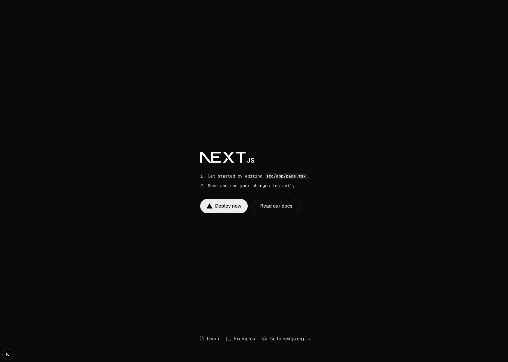

# Next.js
A place for me to learn Next.js

> Next.js is developed & maintained by Vercel

## Installation (macOS)
Requirements:
- Homebrew already installed

Install nodejs
```zsh
brew install node@22
```

Check node version
```zsh
node -v
```

Check NPM version
```zsh
npm -v
```

If you get some errors:
```zsh
brew cleanup
```

Then try again

## Create new project
```zsh
npx create-next-app@latest
```

Afterwards some questions about the project will be asked.
You can leave the settings as default.

## Upgrade to newer Next.js version
```zsh
npx @next/codemod@canary upgrade latest
```

## Run development server
```zsh
npm run dev
```

Afterwards the site can be accessed in the browser at `http://localhost:3000`.



## General structure
- The whole app is organzied in multiple folders. THe typescript files for the app are stored in `src/app`.
- The code is written in TypeScript.
- TypeScript provides the ability to define types (own structures with strings, numbers, etc.). Therefrom the name `TypeScript` comes. ;)

- In `package.json` are the dependencies saved. The Next.js configuration is saved in `next.config.ts`.

- Each folder in `app` represents a route of the application, but its only accessable when a `page.js` or `route.js` file is contained.

- When a folder is named with `_` as prefix, it will be ignored by the routing and not accessable from within the application.

- Folders in parenthesis (Klammern) while not be show in the route. (https://nextjs.org/docs/app/getting-started/project-structure#organize-routes-without-affecting-the-url-path)

- Slugs can be defined by creating a folder in brackets [] like [slug].

- By default the code is executed on the server. When you want to change this behavior the following has to be added to the top of the file:
    ```tsx
    'use client';
    ```

- Its possible to render the most parts of an app on the server and some components, like the hover state of the navbar, on the client. Depending on what makes most sense for the application. Thoose components should be move to a separated JS or JSX file.

- The main function of the app or just a file is defined by `export default`.

- The layout of the app is defined in `layout.js`. The content of `layout.js` is shared between all pages.

- Variables in `TypeScript` can be optional. Optinal variables are declared with a traling question mark (?) after the variables name. Eg. `x?: number`.

- Inside a React component also empty HTML tags like `<>` and `</>` can be used for logical grouping of elements. This will have no impact on the DOM and is just for organization in the code.

## Imports
When importing function and components from other files, there can be named & default imports. Default imports are when you import the default function of a file which was defined by `export default function`.

Default import
```tsx
import LatestInvoices from '../ui/dashboard/latest-invoices';
```

Named import
```tsx
import { fetchRevenue } from '../lib/data';
```

## Styling
In `global.css` some global CSS styling rules were defined. Usally this file is imported in the root layout of the app `layout.js`/`layout.jsx`/`layout.tsx`.

Commonly TailwindCSS is used with Next.js for easier stylings. This can be recognized in the beginning of the `global.css`-File:
```css
@tailwind base;
@tailwind components;
@tailwind utilities;
```

As an alternative to TailwindCSS also CSS modules can be used for styling. There you would create a own CSS file for every component which needs styling and only import those into the project. More details about that can be found in the [Next.js docs](https://nextjs.org/learn/dashboard-app/css-styling).

Additionaly there are other, less popular methods for styling your Next.js app like Sass or CSS-in-JS libraries. And, because in the end just normal CSS is rendered, you can use any styling solution you want/already know too with Next.js.

### TailwindCSS
Tailwind is a CSS framework, which enables you to style the whole website without ever leaving the HTML or Next.js code. You never have to touch a CSS file. All styling is done via predefined CSS classes.

When using VScode as Editor the [`Tailwind CSS IntelliSense`](https://marketplace.visualstudio.com/items/?itemName=bradlc.vscode-tailwindcss) should be installed. It enables autofill for Tailwind css classes aund adds preview of the css behind a class when hovering over it. It improves the development process with TailwindCSS a lot.

The styling is applied when adding a css class to an HTML object.
```jsx
<div className="fixed top-0"></div>
```

When non existing tailwind class matches the value you need, a custom value can be assigend, which will automatically be generated by tailwind on build.
```jsx
<div className="top-[-27px]"></div>
```

#### Common classes
| class | what it does |
| --- | --- |
| top-0 | top: 0; |
| left-0 | left: 0; |
| w-0 | width |
| h-0 | height |
| m-0 | margin |
| mx-auto | margin-inline: auto; |
| p-0 | padding |
| flex | display: flex; |
| h-screen | 100vh; -> viewport height |
| bg-gray-900 | background-color |
| text-white | text color |
| shadow-lg | adds a nice shadow (different variantes are available) |
| rounded-3xl | border-radius |
| transition-all | add a transition to every property that changes |
| hover:<CLASS> | Adds class on hover state |
| group | defines a parent element for a group |
| group-hover:<CLASS> | adds a class on hover over the parent of the group |
| dark:<CLASS> | only apply styling in dark mode |
| md:<CLASS> | media query for desktop devices |
| hidden | display: none; |
| block | display: block; |

Tailwind uses a custom spacing scale. The translation table can be found [here](https://gist.github.com/crswll/5d91b14373f53d66317e407bbba6d3dd).

To specify a hover state in tailwind just add a prefix of `hover:` in front of the styling class.
```jsx
<div className="hover:bg-green-600 hover:text-white"></div>
```

When having a lot of styling on a element it can make sense to create a custom css class combining thoose tailwind classes. This can be done by adding the following to `globals.css`:
```css
@layer components{
  .sidebar-icon{
    @apply relative flex items-center justify-center
            h-12 w-12 mt-2 mb-2 mx-auto shadow-lg
            bg-gray-800 text-green-400
            hover:bg-green-600 hover:text-white;
  }

  /* more custom classes... */
}
```

With `@apply` other css classes can be applied to an element.

With a group in tailwind its possible to change the state of an child based on the parent like on hover over the parent. But groups don't work when using `@apply` in css.
The class `group` has to be added to the parent element. Then a connected hover action can be added to the child via `group-hover:<CLASS>`.
Example:
```jsx
<div className="sidebar-icon group">
    {icon}

    <span className="sidebar-tooltip group-hover:scale-100">
        {text}
    </span>
</div>
```

### Clsx
`clsx` is a library which adds the possibility to toggle css classes based on JS conditions. This is useful to change a styling depending on the value of a state.

## React Icons
React Icons is a easy way to import the most popular icons into a react project.

It can be installed via npm.
```zsh
npm install react-icons --save
```

Now the icons can be used after importing them. Each icon is a custom react component.
```jsx
import { FaPlay } from "react-icons/fa";

<FaPlay />
```

## Fonts
Fonts are managed in the file `/app/ui/fonts.ts`. Next.js is be default able to import fonts from Google Fonts. After importing a font the subset has to be defined. In my case its the latin subset.
```ts
import { Inter } from 'next/font/google';
export const inter = Inter({subsets: ['latin'], weight: ['400', '700']});
```

Afterwards the font can be added to the `layout.tsx` so its visible all over the application.
There also a `className` has to be added to the body, so that the font will be rendered.
```tsx
import {inter} from '@/app/ui/fonts';

export default function RootLayout({
  children,
}: {
  children: React.ReactNode;
}) {
  return (
    <html lang="en">
      <body className={`${inter.className} antialiased`}>{children}</body>
    </html>
  );
}
```

The same way other fonts can be imported and also just applied on single objects.

## Images
Next.js comes with a built-in image component, which does many image optimizations like serving images as `webp` or `avif` where possible, automatically.

The componennt is called `<Image>`.

Example usage:
```tsx
import Image from 'next/image';

export default function Page() {
  return (
          <Image
            src="/hero-desktop.png"
            width={1000}
            height={760}
            className="block"
            alt="just an example"
          />
  );
}
```

The `width` and `height` should be specified to prevent layout shift - the values set are just used for defining the right aspect ratio - Next.js decides by itself which size has to be rendered.

## Layouts
In a `layout.tsx` file the layout of a page with all their subpages is defined. The files has to return a Layout component on the default function. The children should be imported and shown on the layout, else they won't be visible anywhere.

Example `layout.tsx`
```tsx
import SideNav from "@/app/ui/dashboard/sidenav";

export default function Layout({children}: {children: React.ReactNode}){
    return (
        <div className="flex h-screen flex-col md:flex-row md:overflow-hidden">
            <div className="w-full flex-none md:w-64">
                <SideNav />
            </div>
            <div className="flex-grow p-6 md:overflow-y-auto md:p-12">
                { children }
            </div>
        </div>
    );
}
```

## Links
By using the `<Link />` component instead of the HTML tag `<a>` you can to client-side-navigation without a full page reload.

```tsx
import Link from 'next/link';

export default function NavLinks() {
  return (
    <Link
    key={link.name}
    href={link.href}
    className="flex h-[48px] grow items-center justify-center gap-2 rounded-md bg-gray-50 p-3 text-sm font-medium hover:bg-sky-100 hover:text-blue-600 md:flex-none md:justify-start md:p-2 md:px-3"
    >
    <LinkIcon className="w-6" />
    <p className="hidden md:block">{link.name}</p>
    </Link>
  );
}
```

Next.js prefetches the content of the pages linked via `<Link />` so that it can a switch between the pages is faster respectly nearly instant.

To show the currently active link the React hook `usePathname` can be used. To use conditons for changing the css classes you can use `clsx`.
Example:
```tsx
import Link from 'next/link';
import {usePathname} from 'next/navigation';
import clsx from 'clsx';

export default function NavLinks() {
  const pathname = usePathname();

  return (
    <>
      {links.map((link) => {
        const LinkIcon = link.icon;
        return (
          <Link
            key={link.name}
            href={link.href}
            className={clsx(
              "flex h-[48px] grow items-center justify-center gap-2 rounded-md bg-gray-50 p-3 text-sm font-medium hover:bg-sky-100 hover:text-blue-600 md:flex-none md:justify-start md:p-2 md:px-3",
              {
                'bg-sky-100 text-blue-600': pathname === link.href,
              },
            )}
          >
            <LinkIcon className="w-6" />
            <p className="hidden md:block">{link.name}</p>
          </Link>
        );
      })}
    </>
  );
}
```

## Data rendering behaviors
There are two ways of fetching data in Next.js.
- static rendering
- dynamic rendering

Static rendering means that data is fetch while building the app or when the data is revalidating. On each access the cached data will be served. This has the advantage, that the server load can be reduced and the app is faster. Also it has advantages in point of SEO, because there has nothing to be loaded from the server except the page itself.

But this approach isn't useful when personalized data should be shown. There comes dynamic rendering into play.
Dynamic rendering enables to render real time data and personalized content for each user. It's also possible to show infos about the request.

### Data streaming
Data streaming enables you to transfer data to the client in more smaller chunks instead of one full package. So the users see the content, that is already ready and in the background the rest is loaded. So the app feels faster and the user can begin using it earlier. Also the data can be rendered in parellel, instead of waiting until each request is finished.

By adding a `loading.tsx`-File with a `Loading()` component to the app, the streaming can be enabled.
```tsx
export default function Loading(){
    return <div>Loading...</div>;
}
```

The component `Loading()` is shown as a fallback while the "real" content is loaded.

Instead of ugly text a skeleton can be implemented. This has the advantage that the user knows where he can expect content and layout shift is minimized.

This loading behaviour is applied to all subpages of the folder its defined in. To prevent this the files, on which it should be appended, can be moved inside a folder in parenthesis. Folders with parenthesis allows to group pages logical, without affecting the URL path.

With `Suspense` its also possible to just add a skeleton to one component. Then the data fetching process has to be a part of the component. To use `Suspense` the component has to be wrapped inside it.

```tsx
import { Suspense } from 'react';
import { RevenueChartSkeleton } from '@/app/ui/skeletons';

export default async function Page(){
    return (
        <main>
            <div className='mt-6 grid grid-cols-1 gap-6 md:grid-cols-4 lg:grid-cols-8'>
                <Suspense fallback={<RevenueChartSkeleton />}>
                    <RevenueChart />
                </Suspense>
                <LatestInvoices latestInvoices={latestInvoices} />
            </div>
        </main>
    );
}
```

When multiple components should load at the same time, they should be moved in a own component and then be put into `Suspense`.

## Search function
When you want to implement a search function the following Next.js hooks are benefical. When implementing the search feature the search query should be kept in the URL parameters. This makes it easier to get the search query and also allows users to bookmark or share a URL with a specific search term. The search filed should be implemented on the client side, so that the URL parameters easily can be changed.

Example implementation of a search component (client side)
```tsx
'use client';

import { MagnifyingGlassIcon } from '@heroicons/react/24/outline';
import { useSearchParams, useRouter, usePathname } from 'next/navigation';

export default function Search({ placeholder }: { placeholder: string }) {
  const searchParams = useSearchParams();
  const pathname = usePathname();
  const { replace } = useRouter();

  function handleSearch(term: string){
    const params = new URLSearchParams(searchParams);
    
    if (term){
      params.set('query', term);
    }
    else{
      params.delete('query');
    }

    replace(`${pathname}?${params.toString()}`);
  }

  return (
    <div className="relative flex flex-1 flex-shrink-0">
      <label htmlFor="search" className="sr-only">
        Search
      </label>
      <input
        className="peer block w-full rounded-md border border-gray-200 py-[9px] pl-10 text-sm outline-2 placeholder:text-gray-500"
        placeholder={placeholder}
        onChange={(e) => {
          handleSearch(e.target.value);
        }}
        defaultValue={searchParams.get('query')?.toString()}
      />
      <MagnifyingGlassIcon className="absolute left-3 top-1/2 h-[18px] w-[18px] -translate-y-1/2 text-gray-500 peer-focus:text-gray-900" />
    </div>
  );
}
```

When implementing a feature that requires access to the search parameters it depends where the code is excuted. To access the search parameters on the client side `useSearchParams()` from `'next/navigation'` is used. On the server's side you need to pass the prop `searchParams` to the according function.

Server side example
```tsx
export default async function Page(props: {
    searchParams?: Promise<{
        query?: string;
        page?: string;
    }>;
}){

    const searchParams = await props.searchParams;
    const query = searchParams?.query || '';
    const currentPage = Number(searchParams?.page) || 1;
    
    return (
        // return your components
    )
}
```

By implementing a search function this way, every time a user starts typing the search will be queried on each keystroke. This ressolves into a lot requests and unneeded requests. To change this behaviour `Debouncing` can be implemented. `Deboucing` implements a limit to the rate how many queries can be fired.

`Debouncing` can be implemented in a lot of ways. There is a library named `use-debounce` which does it for you. To use it, the search function has to be wrapped into a debounced callback. Here a simple example:
```tsx
const handleSearch = useDebouncedCallback((term) => {
console.log(`Searching... ${term}`)

const params = new URLSearchParams(searchParams);

if (term){
    params.set('query', term);
}
else{
    params.delete('query');
}

replace(`${pathname}?${params.toString()}`);
}, 300);
```

Then before the partenthisis a time to wait before firing the request can be set. In the example it was `300ms`.

## React Server Actions
React Server Action allow to run code asynchronous on the server without the need of an api endpoint. They are focused on security by default.

React Server Actions can be used to get the data from a submitted form. Its also possible to interact with the form even when the belonging javascript code hasn't been loaded.

A file with server action could be named `actions.ts`. In the beginning of the file should be defined, that this file should be executed on the server.
```ts
'use server';
```

So this action will always be executed on the server, even if the function is called within a client run component.

To run a server action as result of a form it has to be added as action to a form component.
```tsx
import { createInvoice } from '@/app/lib/actions';
return(
    <form action={createInvoice}>
    </form>
)
```

The received data can be processed on the server like in this example.
```tsx
'use server';

export async function createInvoice(formData: FormData){
    const rawFormData = {
        customerId: formData.get('customerId'),
        amount: formData.get('amount'),
        status: formData.get('status'),
    };
}
```

> Note: Form inputs of `type="number"` will be sent as `string` to the server not as `number`.

`Zod` is a library that does type validation in `TypeScript`.

By adding the following code a Schema for the type validation can be defined.
```tsx
import { z } from 'zod';

const FormSchema = z.object({
    id: z.string(),
    customerId: z.string(),
    amount: z.coerce.number(),
    status: z.enum(['pending', 'paid']),
    date: z.string(),
});

const CreateInvoice = FormSchema.omit({id: true, date: true});
```

> The `z.corece` does transform the type of the value from `amount` to a `number`.

Follwing code does a type validation before further processing the data with the before defined Schema.
```tsx
export async function createInvoice(formData: FormData){
    const { customerId, amount, status } = CreateInvoice.parse({
        customerId: formData.get('customerId'),
        amount: formData.get('amount'),
        status: formData.get('status'),
    });
}
```

### Revalidating data
Next.js does cache the pages on the client side, so the app is overall faster. But when dynamic data is loaded and something has changed, the client has to know this, so the data can be fetched again. You can tell the client to revalidate his data by doing the following:

```tsx
import { revalidatePath } from 'next/cache';

revalidatePath('/dashboard/invoices');
```

Afterwards the user can be redirect to the according route.
```tsx
import { redirect } from 'next/navigation';

redirect('/dashboard/invoices');
```

## Dynamic routes
A dynamic route is created by creating a folder in squrare brackets [].

You can get the id of the page as part of the page's params.
```tsx
export default async function Page(props: {
    params: Promise<{
        id: string
    }>
}){
    const params = await props.params;
    const id = params.id;

    return (
        // Your component...
    );
}
```

## Error handling
Error handling works in `TypeScript` the same way like in JS.
```tsx
try{
    await sql`DELETE FROM invoices WHERE id = ${id}`;
} catch (error){
    console.error(error);
}
```

> Redirects have to be outside of a try & catch block, becuase a redirect would cause to trigger a error each time it's executed.

A error also can be thrown manually by using `throw`.
```tsx
throw new Error('Failed to delete invoice.');
```

To show an error also to the user instead only on the server you can add a `error.tsx` file. This file needs to be a client component.

Here is a simple example for a such error page:
```tsx
'use client';
 
import { useEffect } from 'react';
 
export default function Error({
  error,
  reset,
}: {
  error: Error & { digest?: string };
  reset: () => void;
}) {
  useEffect(() => {
    // Optionally log the error to an error reporting service
    console.error(error);
  }, [error]);
 
  return (
    <main className="flex h-full flex-col items-center justify-center">
      <h2 className="text-center">Something went wrong!</h2>
      <button
        className="mt-4 rounded-md bg-blue-500 px-4 py-2 text-sm text-white transition-colors hover:bg-blue-400"
        onClick={
          // Attempt to recover by trying to re-render the invoices route
          () => reset()
        }
      >
        Try again
      </button>
    </main>
  );
}
```

It's also possible to create separate error pages for specific errors. An example would be a not found page.

A redirect to a not found page can be implemented with `notFound` from `next/navigation`.

```tsx
import { notFound } from 'next/navigation';

if(!invoice){
    notFound();
}
```

Therefor the file `not-found.tsx` should be created with the UI you want to show, when something is not found.
Thoose specific error pages will be shown before the general error page.


## Ressources
- [Next.js Installation](https://nextjs.org/docs/app/getting-started/installation)
- [Next.js 13 - The Basics](https://youtu.be/__mSgDEOyv8)
- [Next.js React Foundations Course](https://nextjs.org/learn/react-foundations)
- [Next.js Dashboard App Course](https://nextjs.org/learn/dashboard-app)
- [Tailwind in 100 Seconds](https://youtu.be/mr15Xzb1Ook)
- [Ultimate Tailwind CSS Tutorial // Build a Discord-inspired Animated Navbar](https://youtu.be/pfaSUYaSgRo)
- [Why use Question Mark in TypeScript Variable? | GeeksforGeeks](https://www.geeksforgeeks.org/why-use-question-mark-in-typescript-variable/)